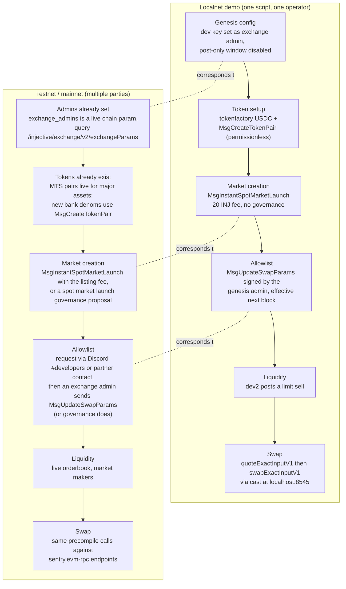

# Swap Precompile (0x68) Example

Quote and execute native spot swaps against Injective's on-chain orderbook from the EVM, using the swap precompile introduced in v1.20.4 (Meridian). An API shaped like familiar AMM routers, filled by exchange module orderbook liquidity: quote, set `minOut` and a deadline, swap in one call.

## Interface

Precompile address: `0x0000000000000000000000000000000000000068` (see [`src/ISwapModule.sol`](src/ISwapModule.sol))

| Function | Type | Purpose |
|---|---|---|
| `quoteExactInputV1(tokenIn, marketId, amountIn) → amountOut` | view | Quote output for an exact input |
| `quoteExactOutputV1(tokenOut, marketId, amountOut) → amountIn` | view | Quote input needed for an exact output |
| `swapExactInputV1(tokenIn, marketId, amountIn, minOut, recipient, deadline) → amountOut` | tx | Execute, reverting below `minOut` or past `deadline` (unix seconds) |

Semantics worth knowing:

- Swaps execute on the caller's default subaccount and revert on failure. The caller must hold `amountIn` of `tokenIn` (ERC20 balances under the MultiVM Token Standard are bank balances, so no separate approve step against the precompile).
- Markets must be allowlisted in `SwapParams` (governed via `MsgUpdateSwapParams`, seeded by the v1.20.4 upgrade handler). A non-allowlisted market reverts with `market <id> is not allowlisted for swaps: invalid swap route`.
- `marketId` is the spot market id string. Find markets: `https://sentry.lcd.injective.network/injective/exchange/v1beta1/spot/markets?status=Active` (testnet: `testnet.sentry.lcd...`). Map bank denoms to ERC20 addresses via `/injective/erc20/v1beta1/all_token_pairs`.

## Quick start

```bash
forge install foundry-rs/forge-std
cp .env.example .env   # add PRIVATE_KEY for swap/deploy targets
make build
make quote             # read-only, no key needed
```

`make quote` calls the live testnet precompile. Until a market is allowlisted it reverts with the allowlist message above, which is itself proof you reached 0x68. Once allowlisted: `make swap` executes from your EOA, or `make deploy` + `make demo-swap DEMO_ADDR=0x...` to swap through the [`SwapDemo`](src/SwapDemo.sol) contract (quote, derive `minOut` from a slippage tolerance, swap, all in one transaction).

Direct `cast` equivalent of `make quote`:

```bash
cast call 0x0000000000000000000000000000000000000068 \
  "quoteExactInputV1(address,string,uint256)(uint256)" \
  0xaDC7bcB5d8fe053Ef19b4E0C861c262Af6e0db60 \
  "0x0611780ba69656949525013d947713300f56c37b6175e02f26bffa495c3208fe" \
  10000000 \
  --rpc-url https://sentry.json-rpc.testnet.injective.network/
```

## Foundry limitation

`forge script` and `forge test` simulate in a local EVM that has no Injective precompiles, so any code path touching `0x68` fails there with `call to non-contract address`. Use `cast` against a real node (as the Makefile does), or deploy contracts and drive them with transactions. This applies to all Injective precompiles, not just swap.

For fully local testing, follow the [precompiles example's local development guide](https://github.com/InjectiveLabs/inj-examples/blob/main/examples/precompiles/README.md#local-development). It runs a real Injective node in Docker (pinned to v1.20.4, so `0x68` is included) with the EVM JSON-RPC at `localhost:8545`. A fresh local chain starts with the swap allowlist empty, matching public networks: launch a spot market and allowlist it via `MsgUpdateSwapParams`, then point `RPC_URL=http://localhost:8545` at the Makefile targets.

## Networks

| | Chain ID | JSON-RPC |
|---|---|---|
| Testnet | 1439 | `https://sentry.json-rpc.testnet.injective.network/` |
| Mainnet | 1776 | `https://sentry.evm-rpc.injective.network/` |

Testnet has run the precompile since v1.20.4-beta (Sep 15, 2026). Mainnet has run it since the v1.20.4 upgrade (Sep 24, 2026).


## Full localnet demo

`./localnet-demo.sh [home_dir]` runs the entire lifecycle on a fresh local chain with a single command: chain init, a tokenfactory USDC with an ERC20 pair (MultiVM Token Standard), an instant INJ/USDC spot market launch, the swap allowlist update, orderbook liquidity, and a real quote-then-swap through the precompile via cast. It needs a v1.20.4+ `injectived`, Foundry's `cast`, and python3 on the PATH.

Three things the demo solves that are easy to get stuck on:

- **The market allowlist without governance.** The script sets `exchange_admins` in genesis to the dev key, so `MsgUpdateSwapParams` (signed with `injectived tx sign`, there is no dedicated CLI command) works immediately. A governance proposal also works since the demo sets a 10 second voting period, but the admin path is one transaction.
- **Post-only mode on fresh chains.** The exchange module's downtime detector puts a new chain into post-only mode, which makes every swap revert with `exchange is in post-only mode`. The demo sets `post_only_mode_blocks_amount_after_downtime` to 1 in genesis so the window expires after one block.
- **Tick-size units.** `instant-spot-market-launch` and `create-spot-limit-order` both speak human units when the decimals flags are set. Chain-format tick values make later orders fail with tick-size mismatches.


### Demo flow vs testnet and mainnet

The demo compresses into one script what is a multi-party process on live networks. The stages are the same; who performs them and how differs:



The two paths that change most on live networks: market creation costs the real listing fee or a governance vote, and the allowlist is a request to the team rather than a key you hold. Everything from the quote onward is identical code.
